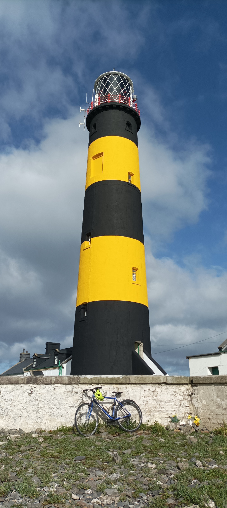

## Who am I?

::::: columns
::: {.column width="35%"}
{width="241"}
:::

::: {.column width="65%"}
-   [PhD in Linguistics:](https://tcd.academia.edu/DesRyan)
    -   "*Principles of English spelling*"
-   [Freelance English teacher]((https://www.linkedin.com/in/drdesryan/))
    -   specialising in pronunciation & communication
    -   Rednote channel forthcoming
-   Former Siri voice engineer
-   [Travel writer](https://a2dez.github.io/to_the_lighthouse/ttl_03_dun_laoghaire_1.html)
    -   cycling to every lighthouse in Ireland

<https://www.linkedin.com/in/drdesryan/>
:::
:::::

## Purpose

-   Putting your existing good English into practice

-   Career focused

-   Starting with university and moving to the workplace

**Now, what do you think you need to know?**

## Topics to be discussed in coming weeks

Clarity and confidence in your communication

-   how to phrase the things you want to say

English for networking and getting to know you (small talk and beyond)

Language for interviews

Workplace culture and etiquette

## Not covered here

Writing workshops – Dr Megan McGurke

-   Academic writing and AI

-   Reports, Presentations, editing, reflection

Pronunciation –\> private lessons (ryand25\@tcd.ie)

## Today's focus

-   How to engage in small talk!

-   Engaging with your lecturers and tutors

-   Group work practice

-   Elevator pitch

## What should you call me?!

Professor

Professor Ryan

Dr Ryan

Mr Ryan

\*Ms Ryan

Des

Des Ryan

Teacher

Sir

Sorry…

## Polite language for asking a question

-   Hey Des, I have a question

-   Sorry Des, can I ask a quick question?

-   Excuse me, Dr Ryan, could I please ask you a question?

Are any of these a problem?

## Small talk, or, getting to know you

-   When

-   How

## Small talk: when?

-   Before lectures, afterwards.

-   You bump into someone you know

-   Waiting for food / the bus

-   etc...

## Small talk: why?!

-   Does this person want to talk to me?

-   The weather, how are you?

## Small talk: what to talk about?

-   Discuss ideas

## Small talk: what to talk about?

-   If yes, then:

    -   Shared experiences, things in common

    -   Differences between you (where are you from?)

    -   College, Ireland, weather, (sport), food, plans, friends, family, ???

    -   Things people care about (but not too much!)

## Small talk: examples

-   Are you enjoying college?

-   What are you doing later / tomorrow / this weekend / for Christmas / after you finish Smurfit

-   People & pets

    -   how's you dog?

    -   how is your sick / nasty / gorgeous flatmate?

Elicit questions

-   Dublin, arrival, accommodation, Did you know!

## Less safe topics

Money / salary

Age

Relationships

Religion?

Politics

Personal appearance?

Immigration, visas?

**The safety might depend on your age, gender, religion, nationality etc.**

## **Etiquette**

-   Give AND take

-   Don't speak all day about your favourite thing

    -   (I love the Tour de France)

-   Spontaneity over planning

    -   What can I respond to?

    -   not what should my next question be

-   Ask –\> Listen –\> Respond –\> Ask

## **Phrases to use**

“Really?”

“No way!”

“Oh, nice.”

“How come?”

“What happened?”

“That sounds interesting.”

“I've never tried that.

# Part 2: Engaging with your lecturers

(also called Module co-ordinators).

**When do you interact with them?**

## When do you engage with your lecturers?

-   During Class

-   After class

-   On the corridor

-   Email

-   Office Hours

-   Assignments, marks etc.

## What would you say? (1)

-   You want to ask your lecturer something after class?
-   You don't understand something the lecturer has just explained.
-   You disagree with the lecturer.

In groups, compare ideas

## The Goldilocks tone: direct v indirect

“That doesn't make sense.

“Sorry, I don't quite understand what you mean by that.

“I'm sorry, but I was wondering if you might possibly be able to clarify what you meant by that?

## Language for politeness: Modal verbs:

will - **would**

can - **could**

shall - should

may - **might**

must / have to.

## Politeness 2: Indirect questions, Adverbs

-   Indirect questions

    -   Could you tell me what that means?

    -   Do you know where I can find a

-   Adverbs (softeners)

    -   **Perhaps** you could, **Maybe** we could

    -   I'm **a little bit** unclear on what that measns.

    -   Could you **possibly** explain that again please?

## After Class / On the corridor

-   Excuse me, Des

-   Morning, Des, how are you?

-   Could I **just** ask you something about the assignment?

-   Could I **quickly** clarify something you told us?

It can be a good idea to define the size and nature of the question.

Quite likely the lecturer will be willing to give a short answer but email might be more appropriate or else you could meet during office hours for a longer discussion.

## Asking a question during class

1.  Clarification

2.  Understanding

3.  Contributing, commenting

4.  Disagreement

NB: some lecturers may encourage questions and comments during class, some would prefer it afterwards.

## Some useful language

1.  **Clarification**

-   Sorry, could you explain what you mean by X?

-   Could you go over that last point again?

-   Sorry, I didn't catch the last part.

2.  **Understanding**
    -   Does that mean that…?

    -   So, if I understand correctly, you're saying that…?

## Adding to the discussion

2.  **Contributing, commenting**

    -   Could I add something here?

    -   Can I ask a slightly different question?

    -   Would it be fair to say that…

3.  **Disagreement**

    -   I'm not sure I completely agree with that.

    -   Could there be another way of looking at this?

    -   I see your point, but I wonder whether…

## What would you say? (2)

1.  You think there's a mistake in your grade.

2.  You want to ask about an assignment.

3.  You want to speak to the lecturer after class.

4.  You need a reference for a job application.

5.  You want an extension.

6.  You want to ask whether an idea would be suitable for your dissertation.

## Elevator pitch

Who are you?

What are you doing?

Why?

Ask these questions to yourself, then share your thoughts with a partner.

## Elevator pitch

I'm a lifelong English language teacher with a PhD in linguistics focussing on English spelling and pronunciation. Nowadays I do workshops with advanced students on how to communicate better and also how to improve their pronunciation.

I actually used to make the Siri voices for Apple and I want to use my technical skills to reach an online audience. I've recently begen making videos on Rednote.

## Elevator pitch

Hi, so what are you studying here and why?
