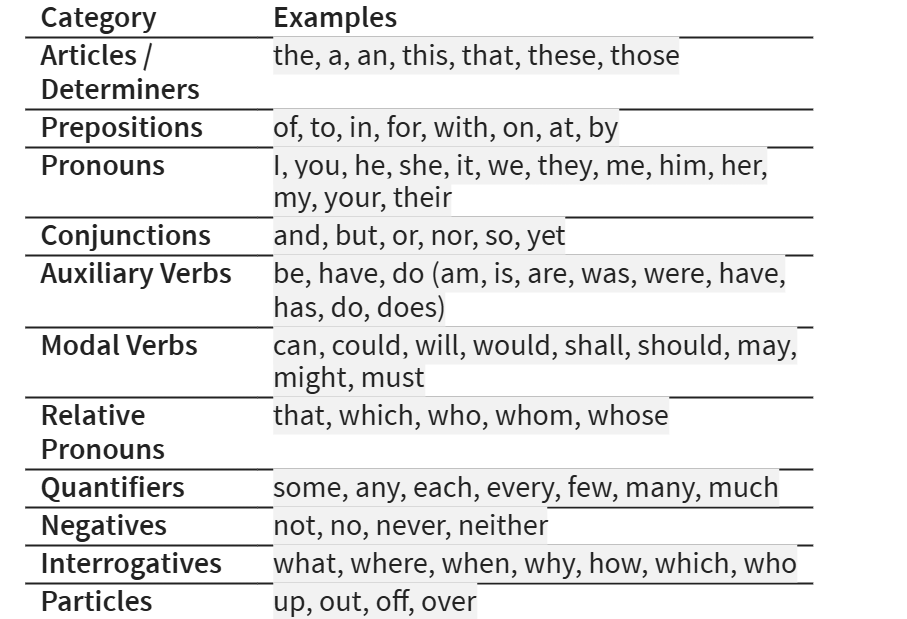

## Sound   like a local in   your next interview

## Who am I?

::::: columns
::: {.column width="35%"}
{width="241"}
:::

::: {.column width="65%"}
-   [PhD in Linguistics:](https://tcd.academia.edu/DesRyan)
    -   "*Principles of English spelling*"
-   [Freelance English teacher]((https://www.linkedin.com/in/drdesryan/))
    -   specialising in pronunciation
-   Former Siri voice engineer
-   [Travel writer](https://a2dez.github.io/to_the_lighthouse/ttl_03_dun_laoghaire_1.html)
    -   cycling to every lighthouse in Ireland
:::
:::::

------------------------------------------------------------------------

## To be or not to be, that is the question

------------------------------------------------------------------------

## To be or not to be, that is the question

to **BE**

or **NOT**

to **BE**

//

**THAT** is the

**QUES**tion

------------------------------------------------------------------------

## Video

<iframe width="800" height="450" src="https://www.youtube.com/embed/bIBUNreInpU" title="YouTube video" frameborder="0" allow="accelerometer; autoplay; clipboard-write; encrypted-media; gyroscope; picture-in-picture" allowfullscreen>

</iframe>

<audio controls>

<source src="Sentence Stress with To Be Or Not To Be.mp3.mp3" type="audio/mpeg">

</audio>

https://www.youtube.com/watch?v=bIBUNreInpU

------------------------------------------------------------------------

## Big words little words

<video width="800" controls>

<source src="to_be_or_not_to_be_1.mp4" type="video/mp4">

</video>

------------------------------------------------------------------------

## Function words v content words

*It was a bright cold day in April,*\
*and the clocks were striking thirteen*\
\
Which words are which??

## Function words

### by category and frequency

## SRES.sed SYL.la.bles and UN.STRESsed SYL.la.bles

**STAN**dard\
**IN**ter**view**\
**QUES**tions

Tell\
me\
a**BOUT** a\
**CHAL**lenge you faced\
and how you **HAND**led it.

## 

::: {.pptx-text style="font-size:20pt; color:#cc0000;"}
1.  Tell me about yourself.

2.  Tell me about a challenge you faced and how you handled it.
:::

::: {.pptx-text style="font-size:20pt; color:#0000CC;"}
3.  What are your strengths.

4.  What is your biggest weakness.

5.  How do you handle pressure or tight deadlines.

6.  Where do you see yourself in five years?

7.  Why do you want to work here?
:::

::: {.pptx-text style="font-size:20pt; color:#cc0000;"}
8.  Do you want to work here?

9.  Do you have any questions?
:::

::: {.pptx-text style="font-size:36pt; color:#000000;"}
**Standard interview questions**
:::

## 

::: {.pptx-text style="font-size:20pt; color:#cc0000;"}
1.  Tell me about yourself.

2.  Tell me about a challenge you faced and how you handled it.
:::

::: {.pptx-text style="font-size:20pt; color:#0000CC;"}
3.  What are your strengths.

4.  What is your biggest weakness.

5.  How do you handle pressure or tight deadlines.

6.  Where do you see yourself in five years?

7.  Why do you want to work here?
:::

::: {.pptx-text style="font-size:20pt; color:#cc0000;"}
8.  Do you want to work here?

9.  Do you have any questions?
:::

::: {.pptx-text style="font-size:28pt; color:#000000;"}
**In pairs, mark the important words / syllables**
:::

::: {.pptx-text style="font-size:20pt; color:#000000;"}
**(Group phrases where helpful)**
:::

## 

::: {.pptx-text style="font-size:20pt; color:#000000;"}
1.  **TELL** me a**bout** your**self**?

2.  **tell** me a**bout**\
    a **CHALL**enge you **faced**\
    and **how** you **han**dled it?

3.  **WHY** do you **want** to **work** here?
:::

::: {.pptx-text style="font-size:20pt; color:#0000CC;"}
2.  **What** are your **strengths**?

3.  **What** is your\
    **big**gest **weak**ness?

4.  **How** do you\
    **han**dle **pre**ssure\
    or **tight** **deadl**ines?

5.  **Where** do you\
    **see** yourself\
    in **five** years?
:::

::: {.pptx-text style="font-size:20pt; color:#000000"}
1.  Do you **have** **a**ny\
    **QUES**tions?

2.  Do you ***want**?* // to **work** here?
:::

## Tell me about yourself

**Answer 1a**\
“I’m originally from Vietnam. I studied business, and I’ve spent the last year working on process‑improvement projects. I’m motivated by solving problems and helping teams work better.”

## Chunking

I’m originally

from Vietnam,

I studied marketing,

and I’ve spent the last year

working on

**process‑improvement projects.**

I’m motivated by solving problems

and helping teams work better.

## Tell me about yourself

I’m o**RI**ginally

from **Vi**et**NAM**,

I **STU**died **BUS**iness,

and I’ve **spent** the **LAST** **year**

**WORK**ing on

**PRO**cess‑im**prove**ment **pro**jects.

I’m **MO**ti**va**ted

by **sol**ving **prob**lems

and **hel**ping **teams**

**work** **bet**ter.”

## Tell me about yourself

**Answer 1b:**\
“I’m originally from Vietnam, I studied business, and I’ve spent the last year working on **projects that involve improving processes**. I’m motivated by solving problems and helping teams work better.”

## Tell me about yourself

I’m o**ri**ginally

from **Vi**et**NAM**,

I **stu**died **MAR**keting,

and I’ve **spent** the **LAST** **year**

**WORK**ing on

**PRO**jects that in**volve**

im**PRO**ving **pro**cesses.

I’m **MO**tivated

by **sol**ving **prob**lems

and **hel**ping **teams** **work** **bet**ter.”

## 2. Why do you want to work here?

A: “I admire the company’s focus on innovation and sustainability, and I see a strong match between your goals and my background in operations.” \
\
B: “I like the culture here and people speak highly of the teamwork. I also think it’s a place where I could grow and contribute straight away.”

## The music of lists 1

**For breakfast, I'd like tea, toast and jam**

UP, UP, down

or

down, down, UP

## The music of lists 2

UP, UP, down

or

down, down, UP

NB English intonation runs across the phrase, not the word.

## Summary

-   Word stress

    -   content v function words

-   Sentence / Phrase stress

-   Chunking

-   Intonation

    -   Yes-No questions v WH-questions

    -   The music of lists

    -   The sound of confidence.
